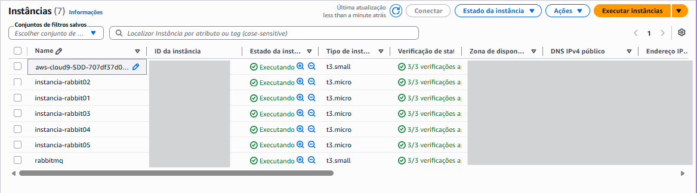
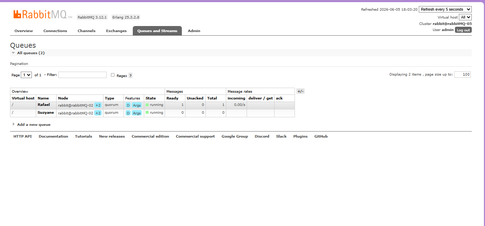
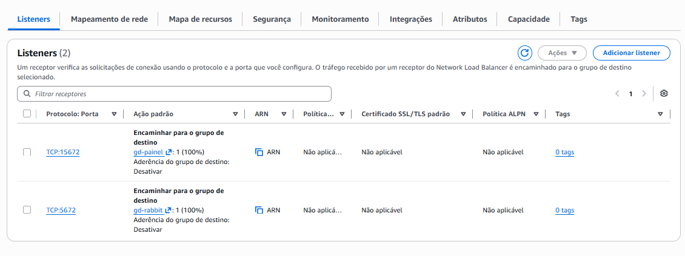
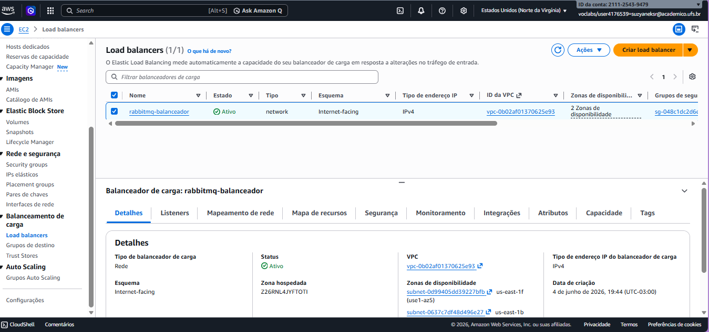
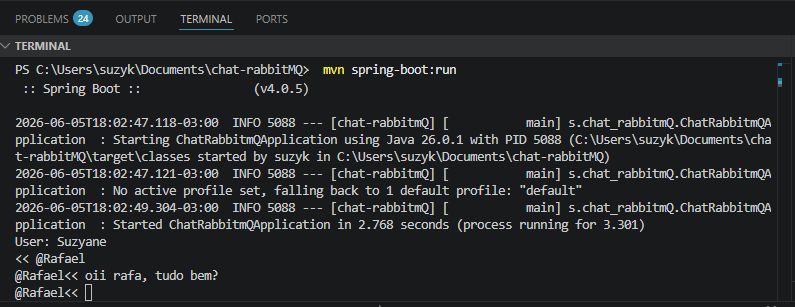

# ChatRabbitMQ: Quarta Etapa

Nesta etapa será implementado um um recurso onde diversas instâncias diferentes do RabbitMQ Server trabalham em conjunto oferecendo um serviço único. 

## 1 - Instâncias
Foram criadas cinco instâncias do RabbitMQ configuradas como cluster, a partir da imagem da instância EC2 configurada na AWS Academy, seguindo os requisitos detalhados no arquivo [rabitmq-ec2.m](https://github.com/tarcisiodarocha/ChatRabbitMQ/blob/master/rabbitmq-ec2.md). 

As instâncias foram configuradas de modo que replicam as filas entre elas com uma taxa de replicação de três (cada fila terá mais duas réplicas em dois outros nós). Com isso, se uma instância cair, o serviço do RabbitMQ e as filas permanecem disponíveis.

## 2- Balanceamento de Rede 
Foi criado um serviço de balanceamento de carga para dois listeners: Interface web de gerenciamento (http) e outro para o protocolo AMQP

## 3 - Rodando o projeto
Antes de executar o projeto, certifique-se de estar  conectado à AWS. 
Em seguida, também conecte-se ao balanceador e serviços das instâncias através dos seguintes comandos para alteração temporária das variáveis  no tempo da sessão.

    $env:RABBITMQ_HOST="{endereço-do-balanceador}"
    $env:RABBITMQ_PORT="5672"
    $env:RABBITMQ_USER="admin"
    $env:RABBITMQ_PASSWORD="minhaInstancia"

